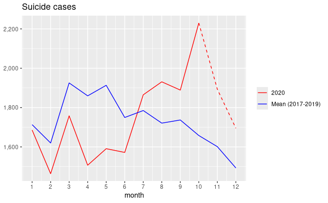
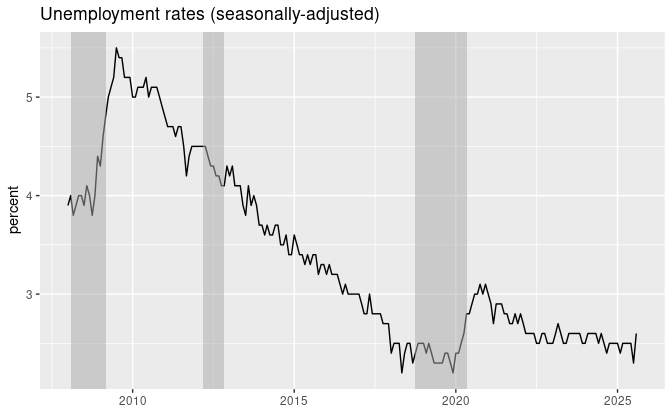
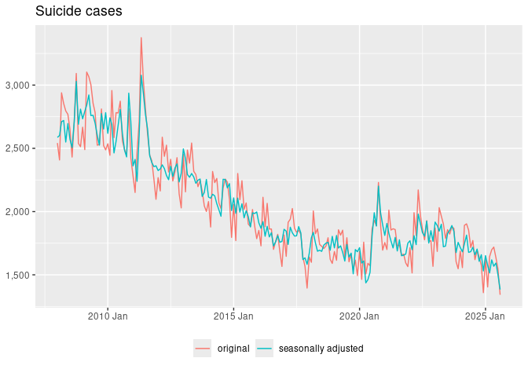

Japan suicide cases reported by National Police Agency
================
Mitsuo Shiota
2020-12-19

- [Motivation](#motivation)
- [Get data from National Police
  Agency](#get-data-from-national-police-agency)
- [Replicate the chart](#replicate-the-chart)
- [Suicide cases are bouncing back, but not as fast as the program
  suggests](#suicide-cases-are-bouncing-back-but-not-as-fast-as-the-program-suggests)

Updated: 2024-11-30

## Motivation

I was watching News Watch 9, an NHK nightly news program, on December
16, 2020. It told suicide cases have been rapidly surging since July
2020 in Japan by showing a chart, which I will replicate later. I felt
the apparent rapid surge might be an exaggeration.

## Get data from National Police Agency

I make a csv file manually from the data in [National Police Agency
site](https://www.npa.go.jp/publications/statistics/safetylife/jisatsu.html).
I can get monthly suicide cases, not separated by gender but total,
since January 2008.

    ## # A tibble: 6 × 4
    ##    year month cases time      
    ##   <int> <int> <dbl> <date>    
    ## 1  2008     1  2542 2008-01-01
    ## 2  2008     2  2408 2008-02-01
    ## 3  2008     3  2939 2008-03-01
    ## 4  2008     4  2854 2008-04-01
    ## 5  2008     5  2796 2008-05-01
    ## 6  2008     6  2769 2008-06-01

## Replicate the chart

I watch the program again in [NHK plus site](https://plus.nhk.jp/),
which requires registration, and replicate the chart below, though the
original chart did not include November and December 2020. Look at the
2020 line, and find it exceeds the Mean (2017-2019) line since July.

Yes, the 2020 line shows a rapid surge up to October. But, why was it
significantly below the Mean (2017-2019) line from April to June in the
first place? I remember National Declaration of State of Emergency to
fight Covid-19 was effective from April 15 to May 24. As “month”
indicates the timing of discovery, not of commitment, in the National
Police Agency data, I suspect some cases were not discovered in the
emergency period, and were discovered later. This may explain some part
of excess from July to October.

## Suicide cases are bouncing back, but not as fast as the program suggests

As I read the book “Towards Evidence-Based Suicide Prevention:
Perspectives from Economics and Political Science”, co-authored by the
original chart creator in the program, I know that the unemployed are
more likely to commit suicide than the employed, and that unemployment
rates are highly correlated with suicide cases.

As Japan has been officially in recession since October 2018, the
unemployment rates hit the bottom in late 2019, and began to climb in
2020.

I draw a chart of both original and seasonally-adjusted cases since
2008. Suicide cases indeed hit the bottom in the beginning of 2020, and
are bouncing back, even though I consider the fluctuations in 2020
should be smoothed out.

EOL
